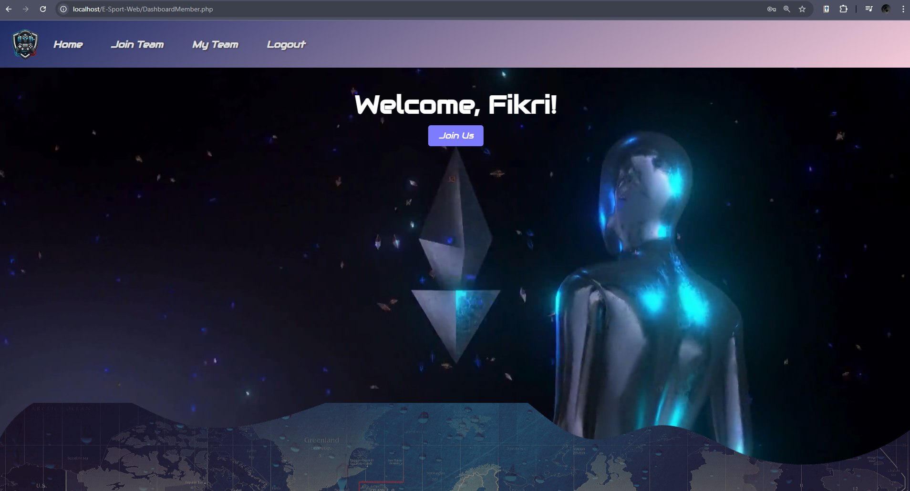
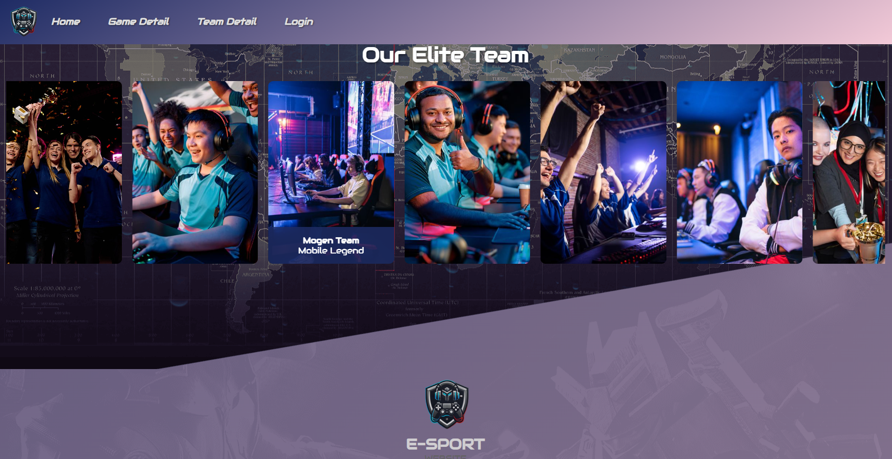
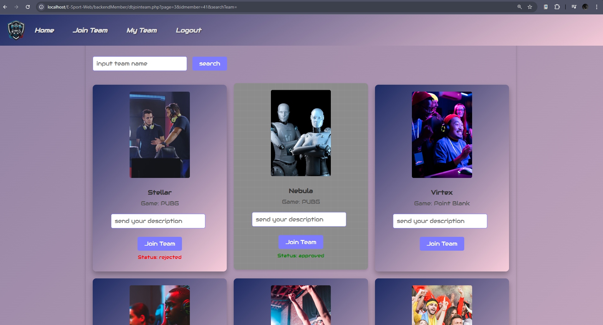
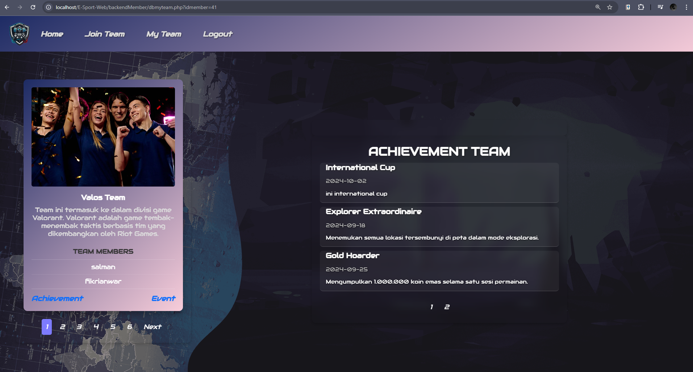
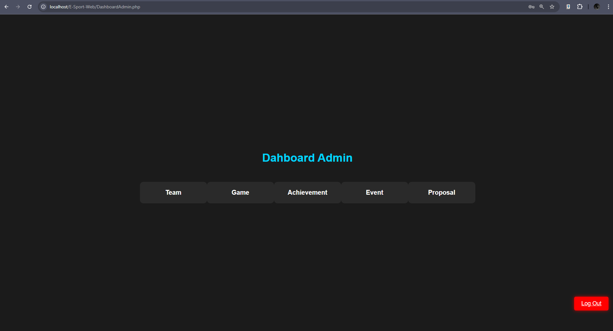
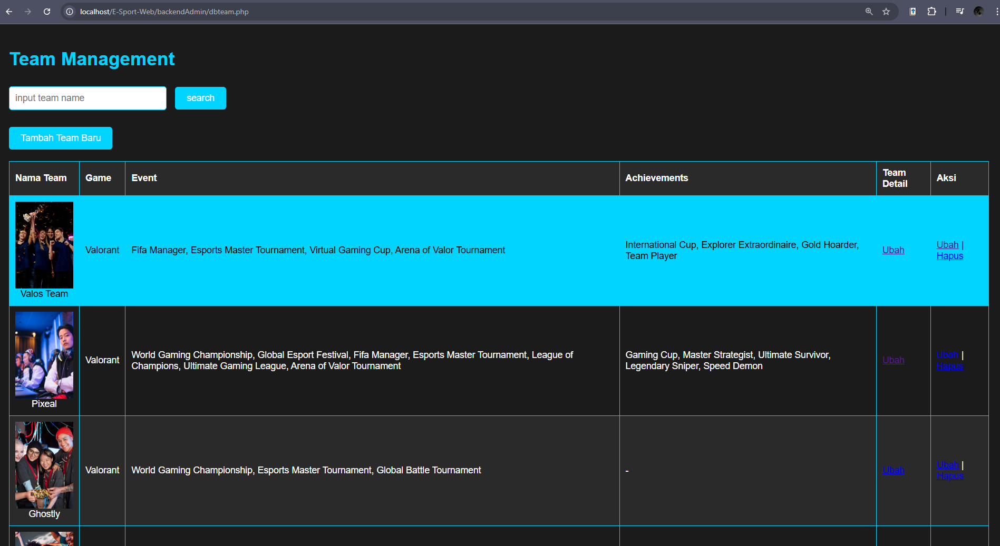
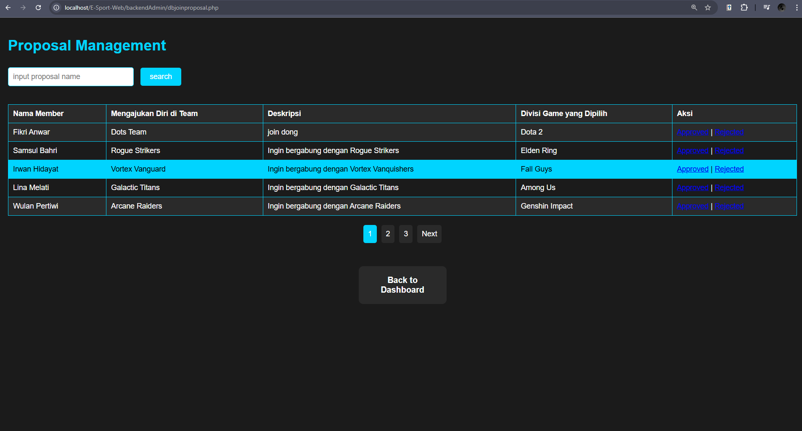

<h1 align="center">
    
</h1>

<h3 align="center">Homepage Member</h3>

<h3 align="center">List Team on Homepage</h3>

<h3 align="center">Join Proposal</h3>

<h3 align="center">User Team</h3>

<h3 align="center">Homepage Admin</h3>

<h3 align="center">Admin Management Team</h3>

<h3 align="center">Admin Proposal Management</h3>

